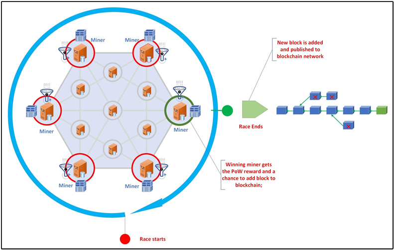

# Proof-of-Work Blockchain Consensus System



## Table of Contents
1. [Overview](#overview)
2. [System Architecture](#system-architecture)
3. [Key Features](#key-features)
4. [Technologies Used](#technologies-used)
5. [Getting Started](#getting-started)
6. [API Documentation](#api-documentation)
7. [Security Measures](#security-measures)
8. [Testing](#testing)
9. [Performance Considerations](#performance-considerations)
10. [Future Enhancements](#future-enhancements)
11. [License](#license)

## Overview

This project implements a robust and scalable Proof-of-Work (PoW) blockchain consensus system. It demonstrates a decentralized, secure, and consistent blockchain ledger maintained through the collaboration of multiple system components: Users, Miners, and Trackers.

The system showcases core blockchain concepts including distributed consensus, cryptographic signing, and resistance to various attack vectors. It's designed with modularity and extensibility in mind, making it an excellent starting point for blockchain-based applications or educational purposes.

## System Architecture

Our PoW Blockchain Consensus System consists of three main components:

1. **User**: Interacts with the blockchain to read the current state and submit new content.
2. **Miner**: Participates in block mining, and transaction validation, and maintains network consensus.
3. **Tracker**: Maintains system integrity and facilitates miner discovery.

### Workflow

1. Users submit content via HTTP requests to Miners.
2. Miners broadcast received content to peers and participate in the mining process.
3. Upon successful mining, the network broadcasts and validates blocks.
4. Miners can register with the Tracker to join the network and discover peers.

## Key Features

- Decentralized consensus through Proof-of-Work
- Cryptographic signing of transactions
- Dynamic miner discovery and registration
- Concurrent processing of transactions
- Resilience against network partitions and malicious actors
- Comprehensive test suite simulating various scenarios including attacks

## Technologies Used

- **Go (Golang)**: Primary programming language
- **Gin Web Framework**: Lightweight HTTP routing
- **RSA Cryptography**: For digital signatures
- **SHA-256**: For hashing operations
- **Treeset**: Efficient sorted set implementation

## Getting Started

### Prerequisites

- Go 1.15+
- Git

### Installation

1. Clone the repository:

```
git clone https://github.com/AllenJWZhu/Distributed-PoW-based-Fault-Tolerant-Blockchain-System.git
```

2. Navigate to the project directory:

```
cd ../Distributed-PoW-based-Fault-Tolerant-Blockchain-System
```

3. Install dependencies:

```
go mod tidy
```

### Running Tests

Execute the comprehensive test suite:

```
make test
```

Note: Test success is dependent on your system's computing power. Adjust the target difficulty if needed.

## API Documentation

### Tracker APIs

#### Get Miners
- **Endpoint**: `/get_miners`
- **Method**: GET
- **Response**: List of active miner ports

#### Register Miner
- **Endpoint**: `/register`
- **Method**: POST
- **Body**: `{"port": <miner_port>}`
- **Response**: Updated list of active miner ports

### Miner APIs

#### Read Blockchain
- **Endpoint**: `/read`
- **Method**: GET
- **Response**: Current blockchain state

#### Write Post
- **Endpoint**: `/write`
- **Method**: POST
- **Body**: `{"user": "<public_key>", "content": "<message>", "timestamp": "<timestamp>", "signature": "<signature>"}`

#### Sync with Peer
- **Endpoint**: `/sync`
- **Method**: POST
- **Body**: List of posts to sync

#### Broadcast Block
- **Endpoint**: `/broadcast`
- **Method**: POST
- **Body**: Updated blockchain

## Security Measures

- RSA key pair generation for user identification
- Digital signatures for post verification
- SHA-256 hashing for block integrity
- Proof-of-Work consensus to prevent Sybil attacks
- Periodic heartbeats to maintain network integrity

## Testing

Our comprehensive test suite covers:

- Post and block safety
- Malicious user and miner scenarios
- Miner discovery and registration
- Complete system interactions
- Blockchain resilience to network partitions
- Simulated computing power attacks

## Performance Considerations

- Adjustable mining difficulty (TARGET constant)
- Configurable posts per block (PostsPerBlock constant)
- Tunable heartbeat and sync intervals for network optimization

## Future Enhancements

- Implement sharding for improved scalability
- Add support for smart contracts
- Introduce a native cryptocurrency and mining rewards
- Implement a peer-to-peer network layer for direct miner communication

## License

This project is licensed under the MIT License - see the [LICENSE](LICENSE) file for details.
